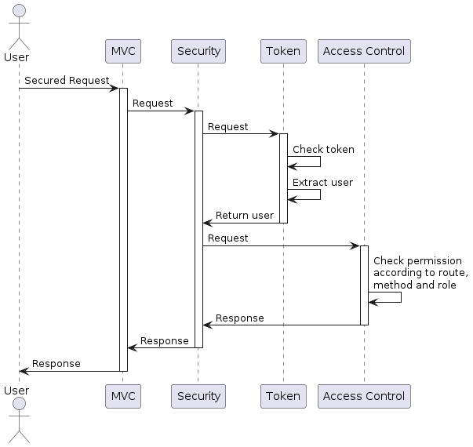

= AUTH (entiCation|oriZation)

Notre réseau social commence par la création d'un compte utilisateur. Nous allons donc mettre en place un système d'authentification et d'autorisation.

== Objectifs pédagogiques

* *Implémenter* un système d'authentification et d'autorisation
* *Implémenter* des microservices

== Étapes

Mettre en place un formulaire d'enregistrement et de connexion pour les utilisateurs.

Créer les microservices d'authentification et d'autorisation.

== Bonus

La correction prendra en compte le bonus. Même si tu ne l'implémentes pas, prends le temps de réfléchir au concept 😉

*Objectif :* créer un service de sécurité

Actuellement, nous avec un service d'autorisation qui ne fait que vérifier le token. Il faudrait lui rajouter la fonctionnalité de contrôle d'accès. Afin de rester dans la logique de micro service, nous allons utiliser un service de sécurité qui s's'appuiera sur un service de vérification du token et un autre service de contrôle d'accès.

Ce service de sécurité pourra être appelé en middleware de toutes les routes du MVC qui ont besoin de sécurisation.

* Crée un service de sécurité qui ne contient qu'un middleware (pas de route). Ce middleware va "orchestrer" les étapes de vérification de l'utilisateur. Affiche simplement un message que tu passes bien dans ce service avec un `console.log`.

```typescript
app.use((req: Request, res: Response) => {
    console.log("coucou")
});
```

* Ajoute un middleware au MVC pour appeler ce service de sécurité, pense à lui passer le token dans le header ainsi que la route et la méthode demandées par l'utilisateur en paramètre. Branche le middleware à une route.
* Branche le service de vérification du token au service de sécurité.
* Crée un service de contrôle d'accès et branche-le au service de sécurité. Ici, il faudra définir les ACL en fonction de la route que tu souhaites atteindre et de qui fait la requête (role_id extrait du token).

Pour mettre en place un contrôle d'accès, il y a une multitude de possibilités. Fait quelques recherches sur internet pour voir ce qui te plaît. L'Access Control Matrix par exemple... Je dis ça je dis rien 🤓 Pour une si petite application on va les coder en "dur", mais on pourrait imaginer une base de données dédiée !

En cadeau, un diagramme de séquence pour t'aider à comprendre le fonctionnement de ce service de sécurité :



Des implémentations bien plus complexes existent avec un découpage encore plus fin des microservices. L'essentiel est que tu comprennes la philosophie 😉